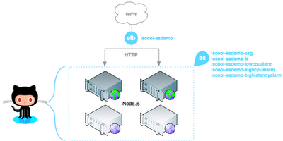

Atelier AutoScaling EC2
=======================

Nous allons utiliser l'[AutoScaling AWS](http://aws.amazon.com/fr/autoscaling/) pour mettre en place un webservice de manipulation d'images qui puisse s'adapter à la charge entrante tout en minimisant les coûts de possession. Pour cela, nous allons partir d'une AMI, automatiser intégralement son lancement, puis l'injecter dans la configuration de notre groupe d'autoscaling afin de pouvoir faire varier le nombre de machines derrière un Elastic Load Balancer.




Pour information, nous allons utiliser une AMI Amazon sur laquelle nous allons installer NodeJS, ImageMagick et [node-imageable-server](https://github.com/dawanda/node-imageable-server), pour fournir un webservice basique (qui tournera en root sur le port 80). Il est également nécessaire d'installer les [EC2 API tools](http://aws.amazon.com/developertools/351), les [ELB tools](http://aws.amazon.com/developertools/2536), les [CloudWatch tools](http://aws.amazon.com/developertools/2534) et les [AutoScaling tools](http://aws.amazon.com/developertools/2535).


Automatisation du boot de l'instance
------------------------------------

Afin d'aller à l'essentiel (cette partie du job peut tout à fait être effectuée par un outil d'orchestration comme Puppet), nous utiliserons les user-data de l'instance pour injecter un script shell exécuté en fin de boot. Celui-ci est en charge :

- de l'installation de NodeJS, git et ImageMagick,
- l'optimisation réseau afin de gérer un grand nombre de courtes connexions TCP simultanées,
- l'installation et le lancement de node-imageable-server.

L'ensemble du script de lancement à passer en user-data est fourni en pièce-jointe de cette page [user-data-imageable](user-data-imageable). A noter qu'il est primordial de minimiser le temps de boot d'une instance afin que notre groupe d'autoscaling soit suffisamment réactif en cas de pic de charge.
Nous allons maintenant pouvoir déclarer les éléments d'infrastructure : ELB et AutoScaling


Déclaration de l'ELB
--------------------

On déclare un ELB nommé upicardie-asdemo sur la zone us-east-1d, qui écoute sur le port 80 et qui répartit les requêtes sur le port 80 des instances :

```bash
elb-create-lb upicardie-asdemo \
  --availability-zones us-east-1d \
  --listener "lb-port=80,instance-port=80,protocol=http"
```

On configure ses tests de viabilité d'une instance :

```bash
elb-configure-healthcheck upicardie-asdemo --target "HTTP:80/" --interval 10 --timeout 5 --unhealthy-threshold 2 --healthy-threshold 2
```

Ces tests sont vitaux afin de s'assurer que l'instance cible ne rentre dans l'ELB que quand  elle est pleinement opérationnelle (à l'issue de son boot via user-data)


Déclaration des groupes de sécurité
-----------------------------------

Les instances d'une groupe d'autoscaling ne dérogent pas aux règles en vigueur sur EC2, elles doivent faire partie d'au moins un groupe de sécurité. Ainsi, nous déclarerons :

- upicardie-asdemo-common : le groupe commun à toutes les instances. Autorise le ping et le SSH de partout.
- upicardie-asdemo-web : le groupe des instances Web. Autorise le HTTP à partir du groupe de sécurité de l'ELB (sg-35b1b441 dans notre cas)

```bash
ec2addgrp upicardie-asdemo-common -d "Serveurs upicardie-asdemo"
ec2addgrp upicardie-asdemo-web -d "Serveurs Web upicardie-asdemo"

ec2auth upicardie-asdemo-common -P icmp -t "-1:-1"
ec2auth upicardie-asdemo-common -P tcp -p 22

ec2auth upicardie-asdemo-web -P tcp -p 80 -u amazon-elb -o sg-35b1b441
```


Création de la configuration de lancement
-----------------------------------------

Avant de déclarer le groupe d'autoscaling à proprement parler, nous allons définir tout ce qui est relatif à une instance du groupe, à savoir :

- son AMI (ami-94cd60fd)
- son type m1.small
- ses groupes de sécurité (upicardie-asdemo-common et upicardie-asdemo-web)
- le fichier user-data qu'on a préparé (user-data-imageable, stocké dans le répertoire courant de la machine à partir de laquelle on tape les commandes d'autoscaling)
- la clé pour l'accès SSH (upicardie-us-east1)

```bash
as-create-launch-config upicardie-asdemo-lc \
  --image-id ami-94cd60fd \
  --instance-type m1.small \
  --group upicardie-asdemo-common,upicardie-asdemo-web \
  --user-data-file user-data-imageable \
  --key upicardie-us-east1
```

Création du groupe d'autoscaling
--------------------------------

Maintenant que nous avons défini la configuration de lancement, nous pouvons déclarer le groupe d'autoscaling avec les paramètres suivants :

- la configuration de lancement (upicardie-asdemo-lc)
- la ou les zone(s) sur lesquelles l'autoscaling prend effet (us-east-1d, en accord avec la déclaration de l'ELB)
- le nombre minimal et maximal d'instances (pour assurer à la fois une certaine disponibilité/QoS et maîtriser les coûts de possession)
- le nom de l'ELB dans lequel inscrire/désinscrire les instances
- le type de test de viabilité (soit celui d'EC2, garantissant la partie hardware, soit celui de l'ELB assurant la disponibilité applicative)
- la période de grâce (= la durée pendant laquelle l'instance n'est pas testée après son lancement. Grosso-modo son temps de boot).

```bash
as-create-auto-scaling-group upicardie-asdemo-asg \
  --launch-configuration upicardie-asdemo-lc \
  --availability-zones us-east-1d \
  --min-size 0 --max-size 0 \
  --load-balancers upicardie-asdemo \
  --health-check-type EC2 \
  --grace-period 300
```

Triggers de mise à l'échelle
----------------------------

Il est ensuite nécessaire de définir la politiques de mises à l'échelle de l'architecture, à la hausse comme à la baisse. Chaque élément AWS (ELB, volume, instance...) dispose de métriques CloudWatch sur lesquelles nous allons nous appuyer pour lancer ou éteindre des machines. Les instances d'un groupe d'autoscaling disposent notamment d'une surveillance CloudWatch détaillée (pas de 1 minute à la place des 5 minutes par défaut).
Commençons par définir notre politique d'ajout de machines (upicardie-asdemo-scale-up) : Nous ajoutons 50% de machines en plus. Le paramètre --cooldown permet de définir une durée (en seconde) pendant laquelle la politique de mise à l'échelle ne sera plus appelée. C'est utile pour laisser les instances se lancer et pour voir les premiers bénéfices de l'ajout d'instances.

```bash
as-put-scaling-policy upicardie-asdemo-scale-up \
  --auto-scaling-group upicardie-asdemo-asg \
  --adjustment 50 \
  --type PercentChangeInCapacity \
  --cooldown 300
```

Même chose pour le retrait de machine : on enlève les machines une à une du groupe d'autoscaling. L'idée est ici de croitre beaucoup plus vite qu'on ne décroit pour pouvoir encaisser facilement des pics de charge successifs.

```bash
as-put-scaling-policy upicardie-asdemo-scale-down \
  --auto-scaling-group upicardie-asdemo-asg \
  --adjustment=-1 \
  --type ChangeInCapacity \
  --cooldown 300
```

L'invocation des commandes ci-dessus renvoie à chaque fois une référence que nous allons pouvoir injecter dans nos déclencheurs... A commencer par la mise à l'échelle à la hausse lorsque :

- l'utilisation CPU moyenne (--statistic Average --metric-name CPUUtilization)
- du groupe d'autoscaling upicardie-asdemo-asg (--namespace "AWS/EC2" --dimensions "AutoScalingGroupName=upicardie-asdemo-asg")
- est supérieure (--comparison-operator GreaterThanThreshold)
- à 70% (--threshold 70)
- pendant plus de 2 relevés distants de 60 secondes (--period 60 --evaluation-periods 2)

```bash
mon-put-metric-alarm upicardie-asdemo-highcpualarm \
  --comparison-operator GreaterThanThreshold \
  --statistic Average --metric-name CPUUtilization \
  --namespace "AWS/EC2" --dimensions "AutoScalingGroupName=upicardie-asdemo-asg" \
  --period 60 --threshold 70 --evaluation-periods 2 \
  --alarm-actions arn:aws:autoscaling:us-east-1:073044293698:scalingPolicy:645473c9-46f4-40a3-8eca-2826d7678548:autoScalingGroupName/upicardie-asdemo-asg:policyName/upicardie-asdemo-scale-up
```

Pareil avec la mise à l'échelle à la baisse lorsque :

- l'utilisation CPU moyenne (`--statistic Average --metric-name CPUUtilization`)
- du groupe d'autoscaling upicardie-asdemo-asg (`--namespace "AWS/EC2" --dimensions "AutoScalingGroupName=upicardie-asdemo-asg"`)
- est supérieure (`--comparison-operator LessThanThreshold`)
- à 36% (`--threshold 36`)
- pendant plus de 2 relevés distants de 60 secondes (`--period 60 --evaluation-periods 2`)

```bash
mon-put-metric-alarm upicardie-asdemo-lowcpualarm \
  --comparison-operator LessThanThreshold \
  --statistic Average --metric-name CPUUtilization \
  --namespace "AWS/EC2" --dimensions "AutoScalingGroupName=upicardie-asdemo-asg" \
  --period 60 --threshold 36 --evaluation-periods 2 \
  --alarm-actions arn:aws:autoscaling:us-east-1:073044293698:scalingPolicy:42005b3f-44b3-4aa2-b352-156cb6bdd428:autoScalingGroupName/upicardie-asdemo-asg:policyName/upicardie-asdemo-scale-down
```

Nous allons ensuite prendre soin de la QoS de notre service en définissant une mise à l'échelle à la hausse lorsque :

- la latence moyenne (`--statistic Average --metric-name Latency`)
- du load-balancer upicardie-asdemo (`--namespace "AWS/ELB" --dimensions "LoadBalancerName=upicardie-asdemo"`)
- est supérieure (`--comparison-operator LessThanThreshold`)
- à 3 secondes (`--threshold 3`)
- dès le premier relevé (`--period 60 --evaluation-periods 1`)

```bash
mon-put-metric-alarm upicardie-asdemo-highlatencyalarm \
  --comparison-operator GreaterThanThreshold \
  --statistic Average --metric-name Latency \
  --namespace "AWS/ELB" --dimensions "LoadBalancerName=upicardie-asdemo" \
  --period 60 --threshold 3 --evaluation-periods 1 \
  --alarm-actions arn:aws:autoscaling:us-east-1:073044293698:scalingPolicy:645473c9-46f4-40a3-8eca-2826d7678548:autoScalingGroupName/upicardie-asdemo-asg:policyName/upicardie-asdemo-scale-up
```

Notre autoscaling est dorénavant fonctionnel. Pour lancer le service, il suffit de passer le min/max du nombre d'instances du groupe d'autoscaling de 0/0 à 2/12 par exemple :

```bash
as-update-auto-scaling-group upicardie-asdemo-asg --min-size 2 --max-size 12
```

Mise à l'échelle programmée
---------------------------

Dans certains cas, il est possible de prévoir la charge sur la plate-forme et de programmer, à une certaine heure et une certaine récurrence la mise à l'échelle de l'autoscaling en jouant sur le min/max par exemple. Les deux régles suivantes vont définir un passage à 3 instances minimum à 22h15 UTC chaque jour (syntaxe cron) :

```bash
as-put-scheduled-update-group-action upicardie-asdemo-preemptive-upscale \
  --auto-scaling-group upicardie-asdemo-asg \
  --min-size 4 \
  --max-size 12 \
  --recurrence "15 22 * * *"
```

suivi d'un retour à 2 instances minimum à 4h00 UTC chaque jour :

```bash
as-put-scheduled-update-group-action upicardie-asdemo-preemptive-downscale \
  --auto-scaling-group upicardie-asdemo-asg \
  --min-size 2 \
  --max-size 12 \
  --recurrence "0 4 * * *"
```

Mise à jour de l'autoscaling
----------------------------

Les commandes d'autoscaling prévoient la mise à jour du groupe d'autoscaling, mais pas de la configuration de lancement de ce même groupe. Qu'importe, nous pouvons contourner cette limitation en passant une configuration de lancement temporaire. Si nous voulons par exemple changer l'AMI de nos instances de ami-94cd60fd vers ami-42421337 :

```bash
as-create-launch-config upicardie-asdemo-lc-tmp \
  --image-id ami-42421337 \
  --instance-type m1.small \
  --group upicardie-asdemo-common,upicardie-asdemo-web \
  --user-data-file user-data-imageable \
  --key upicardie-us-east1

as-update-auto-scaling-group upicardie-asdemo-asg \
  --launch-configuration upicardie-asdemo-lc-tmp

as-delete-launch-config -f --launch-config upicardie-asdemo-lc

as-create-launch-config upicardie-asdemo-lc \
  --image-id ami-42421337 \
  --instance-type m1.small \
  --group upicardie-asdemo-common,upicardie-asdemo-web \
  --user-data-file user-data-imageable \
  --key upicardie-us-east1

as-update-auto-scaling-group upicardie-asdemo-asg \
  --launch-configuration upicardie-asdemo-lc

as-delete-launch-config -f --launch-config upicardie-asdemo-lc-tmp
```

Note : cette double déclaration de configurations de lancement peut être évitée si on horodate le nom de la configuration plutôt que de le garder fixe.


Fight!
------

En guise de démonstration, nous avons définis deux groupes d'autoscaling :
celui du service web précédemment décrit
un sans ELB, avec une configuration de lancement permettant de lancer des machines Tsung simulant des utilisateurs de notre webservice.

Les Tsung ont gagné :)
